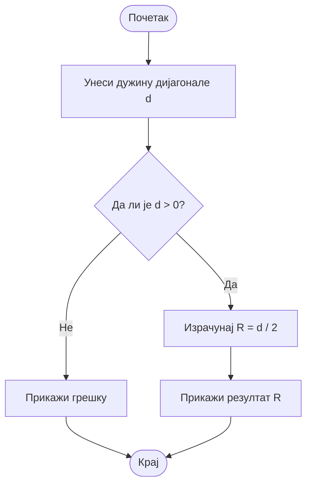

# Домаћи задатак из Техничке документације

## Задатак

Програм који на основу унете дужине дијагонале правоугаоника d израчунава полупречник описаног круга R.

𝑅=d/2​

### Алгоритамска шема



## Решење

``` cs
using System;

class Program
{
    static void Main()
    {
        Console.WriteLine("Програм за израчунавање полупречника описаног круга правоугаоника.");
        Console.Write("Унесите дужину дијагонале d: ");

        string input = Console.ReadLine();

        if (!double.TryParse(input, out double d) || d <= 0)
        {
            Console.WriteLine("Грешка: потребно је унети позитиван број.");
            return;
        }

        double R = d / 2.0;

        Console.WriteLine($"Полупречник описаног круга R = {R}");
    }
}
```
### Објекти

|Назив променљиве | Тип променљиве | Опис |
| ---------- | ---------- | -------------- |
| d.         | `double`    | `дијагонала правоугаоника`       |
| R.         | `double`    | `полупречник описаног круга`       |
| input.         | `string`        | `унети текст пре конверзије`       |
